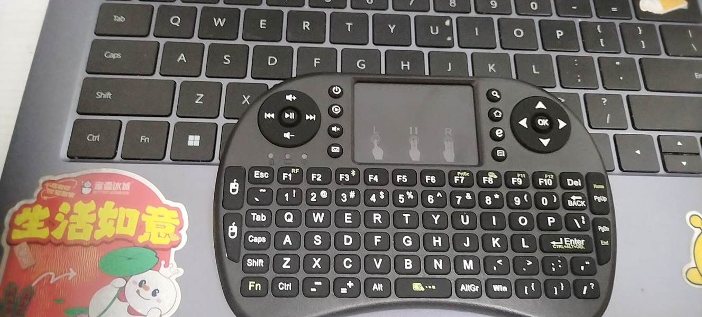

# EntertainingIsland


一个为 [ClassIsland](https://github.com/ClassIsland/ClassIsland) 设计的娱乐功能插件，让同学眼前一亮，老师眼前一黑。兼容 ClassIsland 2.0.1+。

> 注意：开始前建议先去PDD花十多块钱买个很小的无线键盘**（如下图所示，不是带货）**，这种东西不仅小不容易被老师发现，而且遥控距离很远，不过实测下来品质一般，用一两个学期就失灵了。
>
> 
>
> 欢迎访问我的个人网站，专门记录我在学校干坏事：[xxtsoft.top](https://xxtsoft.top)
>
> 也可以去B站看我发的宣传片，我想这是我迄今为止剪过最棒的视频了[立即观看，关注BSOD-MEMZ谢谢喵](https://www.bilibili.com/video/BV15KEt6mEFP)

---

## 功能概览

| 功能                 | 简介                                      |
| -------------------- | ----------------------------------------- |
| **防巡堂警报** | 按下热键弹出全屏提醒                      |
| **下课倒计时** | 下课前一比一照搬 ClassIsland 内置样式提醒 |
| **小说阅读器** | 在课表上偷偷看 txt 小说                   |
| **口头禅记录** | 一键 +1 老师经典语录                      |
| **RSS 新闻**   | 课表上滚动显示新闻标题                    |
| **头像课程表** | 老师头像 + 科目图标展示当日课程           |
| **点名器**     | 随机抽人，支持加权爆率 + 保底             |
| **体育赛事**   | NBA / 英超 / 西甲等比赛实时比分           |
| **每日运势**   | 每日宜忌运势      |
| **摄像头安全** | 摄像头被调用时显示绿色圆点提醒            |
| **全局安全键** | 一键消警 + 隐藏所有娱乐组件               |
| **自动化行动** | 17 个行动 + 3 个触发器，可按时间/状态自动触发 |

---

## 防巡堂警报

按下 `Ctrl+Shift+J` 全屏弹窗提醒外面有老师视奸

- 自定义警报文字、热键
- 强调效果
- 显示时长 / 语音播报 / 提示音效 / 窗口置顶
- 设置入口：ClassIsland 设置 → **提醒** → 窗外有老师警报


## 下课倒计时提醒

样式 **一比一照搬 ClassIsland 内置「即将上课」**。

- 弥补 ClassIsland 只有即将上课提醒没有即将下课提醒的缺憾
- 自定义提前秒数、遮罩文字、详细文字
- 语音播报 / 强调效果 / 显示教师名称
- 设置入口：ClassIsland 设置 → **提醒** → 下课倒计时提醒


## 小说阅读器

把 txt 小说放到课表上滚屏阅读。

- 自动翻页（可调间隔）
- 显示页码和进度百分比
- `Ctrl+Shift+↑/↓` 翻页 · `Ctrl+Shift+Space` 暂停/继续
- 自动保存阅读进度


## 口头禅记录

记录老师或班上管纪律的说了多少次口头禅，目前只支持人工记录，语音识别什么的懒得搞了

- 完全自定义口头禅文字和快捷键
- 每日自动清零


## RSS 新闻

订阅 RSS/Atom 源，在课表上轮播显示。

- `Ctrl+←` / `Ctrl+→` 翻页
- `Ctrl+Shift+O` 打开当前链接
- 内置一些中文源


## 头像课程表

以老师头像 + 科目图标展示当日课程表。

- 自定义头像—科目—教师三层映射
- 已上课程自动降饱和度 + 降低透明度
- 当前课程放大 + 入场动画
  **警告：不建议为真人老师头像使用最低饱和度（黑白）效果**


## 可作弊点名器

- 屏幕浮窗选择抽一人 / 抽两人
- 结果同步 ClassIsland 通知
- 支持 txt 导入名单
- 隐藏爆率面板：`Ctrl+Shift+Alt+C`（加权 + 保底）


## 体育赛事

实时比赛数据，来自 TheSportsDB。

- 预设 11 个主流联赛（NBA / 英超 / 西甲 / 德甲 等）
- 详细 / 简洁两种显示模式
- `Ctrl+Shift+M` 切换显示模式


## 每日运势

每日随机宜忌运势，专为高中生打造的趣味玄学指南。

- 支持自定义条目池，自由增删
- "借您吉言"模式：只显示宜，不看忌
- 一键手动刷新，换一签


## 摄像头安全指示器

防止老师调用一体机前置摄像头视奸学生。

- 摄像头被调用时，主界面显示绿色圆点提醒
- 弹出动画 + 闲置时收缩为小圆点
- 可调轮询间隔（500ms ~ 10000ms）
- 支持自动化触发：摄像头开启/关闭时执行规则


## 全局安全键

当遇到紧急情况，立即按下：`Ctrl+Shift+K`

1. 立即消警
2. 一键隐藏/显示所有娱乐组件

## ClassIsland 自动化

17 个自动化行动 + 3 个触发器，支持在 ClassIsland 规则中按时间/状态触发：

| 类型       | 行动                                       |
| ---------- | ------------------------------------------ |
| 全局组件   | 切换显隐 / 全部显示 / 全部隐藏             |
| 小说阅读器 | 暂停 / 继续 / 下一页 / 上一页 / 重新开始   |
| RSS 新闻   | 上一条 / 下一条                            |
| 口头禅     | 清空记录                                   |
| 摄像头     | 切换监控 / 启用监控 / 禁用监控             |

| 触发器                   | 触发时机             |
| ------------------------ | -------------------- |
| 摄像头被使用时           | 摄像头状态变为「使用中」 |
| 摄像头被关闭时           | 摄像头状态变为「空闲」   |
| 点名器抽中特定人           | 可配合规则自动执行     |

---

## 快捷键速查

| 快捷键                   | 功能                                   |
| ------------------------ | -------------------------------------- |
| `Ctrl+Shift+J`         | 触发防巡堂警报                         |
| `Ctrl+Shift+K`         | 全局安全键（消警 + 隐藏/显示所有组件） |
| `Ctrl+Shift+F1`~`F3` | 口头禅 +1                              |
| `Ctrl+Shift+↑/↓`     | 小说翻页                               |
| `Ctrl+Shift+Space`     | 小说暂停/继续                          |
| `Ctrl+←/→`           | RSS / 赛事翻页                         |
| `Ctrl+Shift+O`         | 打开当前 RSS 链接                      |
| `Ctrl+Shift+M`         | 切换赛事详细/简洁模式                  |
| `Ctrl+Shift+Alt+C`     | 切换点名器爆率面板                     |

---

## 安装

1. 下载 `.cipx` 插件包
2. 在 ClassIsland 中打开「插件」→「安装插件」→ 选择文件
3. 或者手动放入 `data\Plugins\entertainingisland.app\`

## 开发

```bash
# 构建
dotnet build -c Release

# 部署到本地 ClassIsland
.\deploy.ps1
```

## 发布打包

> 建议先用 `dotnet publish -c Release`，再从 `publish/` 目录取文件。

打包为 `.cipx`（即 zip 改后缀），需包含：

- `manifest.yml` — 插件清单
- `icon.png` — 插件图标
- `EntertainingIsland.dll` — 主程序集
- `EntertainingIsland.deps.json` — 依赖清单
- `runtimes/` — .NET 运行时文件
- `README.md` — 说明文档（可选）

---
